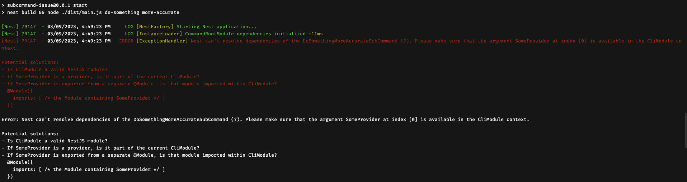

# Subcommand Issue

## Description

Repository to try to reproduce issue with both Nest & Nest Commander.

## Installation

```bash
$ npm install
```

## Running the app

```bash
$ npm run start
```

## Expected issue



## Takeaway

Thanks for your help :)
